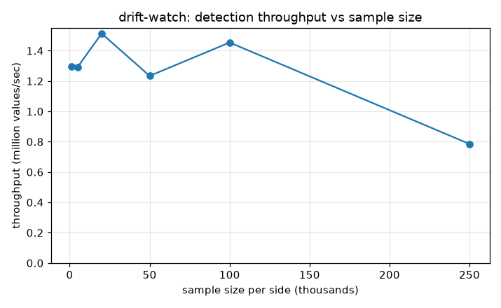
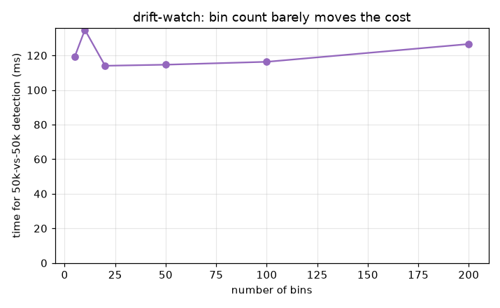

# Benchmarks

Produced by `bench/benchmark.py` (needs `matplotlib`; the library and its tests have no
third-party dependencies - that's the whole point of the no-numpy design):

```
python bench/benchmark.py
```

It writes the two graphs below and `bench/results/summary.json`. These measure the
Python reference implementation; the C# and Java ports run the identical algorithm and
are faster.

## Throughput vs sample size



Detecting drift between two samples, counting every value processed on both sides:

| Sample size (per side) | Throughput |
|:----------------------:|:----------:|
| 1,000 | ~1.29M values/sec |
| 5,000 | ~1.29M values/sec |
| 20,000 | ~1.51M values/sec |
| 50,000 | ~1.23M values/sec |
| 100,000 | ~1.45M values/sec |
| 250,000 | ~0.79M values/sec |

Detection is O(n) - it bins both samples and sums a handful of terms per bin - so
throughput holds around 1.3 million values/second across a wide range of sizes. The dip
at 250k is the working set outgrowing CPU cache, not an algorithmic change (the compiled
ports pay less of that tax). Even at the slow end, a 250k-vs-250k check is well under a
second in pure Python.

## Cost vs bin count



A fixed 50,000-vs-50,000 detection, varying the number of histogram bins:

| Bins | Time |
|:----:|:----:|
| 5 | ~119 ms |
| 10 | ~135 ms |
| 20 | ~114 ms |
| 50 | ~115 ms |
| 100 | ~116 ms |
| 200 | ~127 ms |

Bin count barely moves the needle - all six land within noise of each other. That's
because the cost is dominated by binning the 100,000 values, while the PSI/KL sum runs
over just the bins (5 or 200, both tiny). So you can pick the bin resolution that makes
statistical sense for your feature without worrying about the performance cost.

## Reading these together

The takeaway is that drift detection is cheap and its cost is predictable: linear in the
data, flat in the bin count. A monitoring job can run a drift check on every feature,
every cycle, without it ever being the expensive part - which is exactly what you want
from a no-dependency statistic you compute everywhere.
