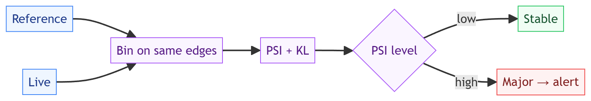

# drift-watch: design, trade-offs, and non-goals

Status: accepted
Author: Parag Sawant

Why drift-watch is built the way it is. It answers "has this feature's distribution
moved since the model was trained?" and the design is about making that a number you can
trust and gate on, in three languages, without pulling in a numeric stack.

## Problem and goals

Models decay when the data they see in production drifts away from the data they were
trained on. drift-watch quantifies that drift for a numeric feature: given a reference
("expected") sample and a live ("actual") sample, it bins both and measures how much the
distribution moved, then classifies the severity so you can alert or gate. Goals:

1. **Quantify distribution shift** with the two standard measures - Population Stability
   Index (PSI) and KL-divergence.
2. **Classify severity** (stable / minor / major) off well-known PSI thresholds, so the
   output is an actionable signal, not just a number.
3. **No numeric dependency**, so the exact same logic ports to Python, C#, and Java -
   a drift score should be identical regardless of which service computes it.

*(Source: [`docs/diagrams/drift-detection-flow.excalidraw`](docs/diagrams/drift-detection-flow.excalidraw) - editable in [excalidraw](https://aka.ms/excalidraw).)*

## Key design decisions

**Bin over the reference range, then compare proportions.** Both samples are binned
using edges derived from the *reference* distribution, and PSI/KL are computed over the
resulting proportions. Anchoring the bins to the reference is what makes "the actual
moved relative to expected" meaningful - if you re-binned per sample, you'd be comparing
two different rulers.

**Epsilon smoothing, on purpose.** PSI and KL both divide by and take logs of bin
proportions, which explode when a bin is empty. A small epsilon floor on each proportion
keeps the result finite and non-negative on every input - including the degenerate ones
(a constant sample, a bin the live data never hits). The stress suite hammers this with
thousands of random and degenerate pairs and asserts no NaN, no infinity, never
negative.

**Pure numeric logic, no numpy.** Everything is plain loops and `math`. That's slower
than a vectorized library, but it's the reason the C# and Java ports are line-for-line
equivalent and produce identical scores - which matters more than raw speed for a
statistic you compare across services and over time.

## Trade-offs I made on purpose

- **No-dependency loops over vectorization.** A numpy/BLAS implementation would be
  faster, but it would make the three-language parity claim hand-wavy and add a heavy
  dependency to a small library. The benchmark shows the pure version still does ~1.3
  million values/second, which is far more than any real monitoring window needs.
- **Fixed-width bins by default.** Equal-width bins over the reference range are simple
  and predictable. Quantile bins would handle skewed features better and are a reasonable
  option, but equal-width keeps the math transparent and the ports identical; noted as a
  refinement.
- **Numeric features only.** drift-watch handles continuous numeric features. Categorical
  drift (a chi-square or a categorical PSI) is a natural sibling but a different code
  path, deliberately out of scope here.

## Benchmarks

See `BENCHMARKS.md`. Short version: detection runs at ~1.3 million values/second in pure
Python and the cost is essentially flat in the bin count (5 bins or 200 bins land within
noise of each other), because binning dominates and log/divide over a handful of bins is
cheap. In practice a drift check over a realistic window is sub-millisecond to a few
milliseconds - trivial to run on every monitoring cycle.

## Non-goals

- **Not a monitoring platform.** It computes a drift score; scheduling checks, storing
  history, and alerting are the caller's job.
- **Not categorical or multivariate.** One numeric feature at a time. Categorical drift
  and joint/multivariate drift are separate problems, not shoe-horned in here.
- **Not a retraining trigger.** It tells you a feature drifted and how badly; deciding to
  retrain is a policy on top.

Part of [parag-labs](https://github.com/parag-labs) - small, focused tools for building AI systems you can trust.
