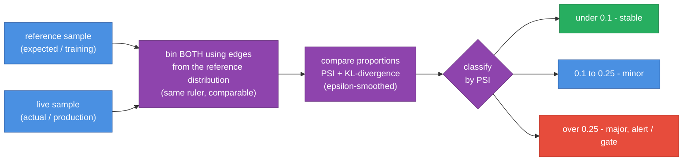

# DriftWatch

**Catch model degradation before your users do.**

Models silently rot when production data drifts away from what they were trained on. DriftWatch quantifies that drift with the two industry-standard metrics - **PSI (Population Stability Index)** and **KL-divergence** - and classifies severity so you can alert or block. Same math in **Python, C#, and Java**.

## The problem

You ship a model, it works, everyone moves on. Six weeks later inputs have shifted (a new user segment, a changed upstream feature) and accuracy quietly craters. Nobody notices until it's a customer complaint. DriftWatch turns "silent rot" into a measurable, alertable signal.

## What it does

- **PSI** between a reference sample and a live sample of a numeric feature.
- **KL-divergence** over the same binned distributions.
- **Severity classification** using standard PSI thresholds:
  - `< 0.10` → **stable**
  - `0.10-0.25` → **minor** drift
  - `> 0.25` → **major** drift (alert / retrain)

## Use it (Python)

```python
from drift import detect_drift

result = detect_drift(reference_sample, live_sample)
print(result.psi, result.severity)   # e.g. 0.83 Severity.MAJOR
```

Or from the command line (two files, one number per line; exits 1 on major drift):

```bash
cd python
python src/cli.py reference.txt current.txt
```

## Three languages, one result

| Language | Tests | Run |
|----------|:-----:|-----|
| Python | 7 | `cd python && pytest -q` |
| C# (.NET 10) | 6 | `cd csharp && dotnet test` |
| Java (17+) | 6 | `cd java && mvn test` |

The binning + PSI/KL math is pure numeric logic (no numpy/ML.NET/DL4J), so all three agree.

## Known limitations / next

- Numeric features only - categorical drift (chi-square) is an obvious extension.
- Equal-width binning; quantile binning is more robust for skewed data.
- For unstructured/LLM inputs, compute drift over **embeddings** instead of raw values (a planned addition).

## Design notes and numbers

- **[DESIGN.md](DESIGN.md)** - why bin over the reference range, the epsilon smoothing
  that keeps it finite, the no-numpy/three-language parity trade-off, and the non-goals.
- **[BENCHMARKS.md](BENCHMARKS.md)** - detection throughput vs sample size and cost vs
  bin count, with graphs. Reproduce with `python bench/benchmark.py`.

## How it works



## Layout

```
drift-watch/
├── python/         reference implementation (PSI + KL) + pytest suite
├── csharp/         .NET 10 port - Drift.cs + tests
├── java/           JDK 17+ port (Maven)
├── bench/          benchmark.py - drift-score cost vs feature count
├── docs/diagrams/  architecture diagrams
├── DESIGN.md       why PSI and KL, bucketing choices, weighting by importance
└── BENCHMARKS.md   reproducible numbers
```


Part of [parag-labs](https://github.com/parag-labs) - small, focused tools for building AI systems you can trust.
